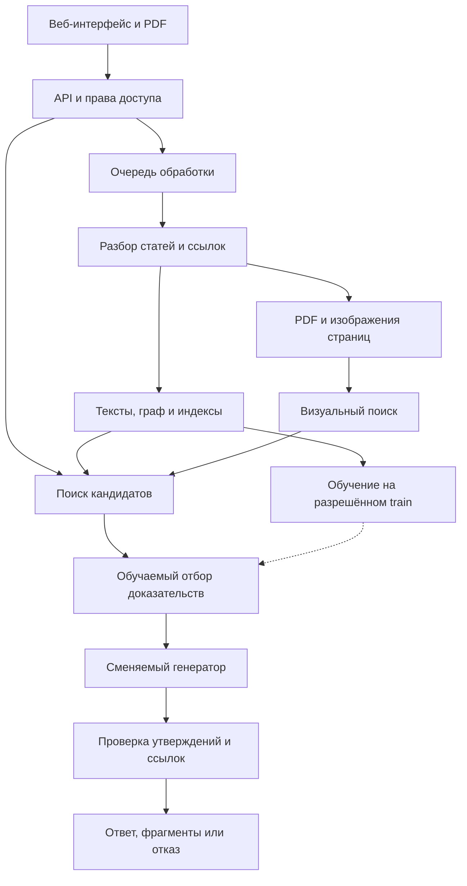

# 181 · Research Assistant для научных статей

**Поиск проверяемых ответов в статье и её источниках**

Читатель загружает PDF, добавляет цитируемые работы и задаёт вопрос. Приложение ищет подтверждения в доступных публикациях, показывает связи между ними и открывает нужную страницу источника. Если материала для ответа не хватает, пользователь видит, какой источник отсутствует и что удалось установить по имеющимся текстам.

| Паспорт проекта | Сведения |
|---|---|
| Итоговая тема | **Research Assistant: поиск и проверка доказательств в локальном графе научных публикаций** |
| Трек и уровень | Deep Learning · PRO |
| Команда | Татарченко Евгений Андреевич |
| Куратор | Соборнов Тимофей |
| Учебный период | С 1 октября 2026 года по 31 мая 2027 года |
| Состояние на 02.10.2026 | Подготовлен план. Приложение, обученная модель и экспериментальные результаты пока отсутствуют |

[План семи чекпойнтов](docs/roadmap.md) · [Протокол исследования](docs/research-protocol.md) · [Архитектура и требования](docs/architecture.md) · [Источники](docs/references.md)

## Задача

В научной статье часть объяснений вынесена в цитируемые работы. Поиск только внутри загруженного PDF не позволяет проверить, что именно установил первоисточник, при каких условиях получен результат и насколько точно его пересказывает автор новой статьи.

Проект связывает текст статьи, места цитирования и доступные полные тексты источников. Единица ответа содержит утверждение, подтверждающий фрагмент, идентификатор публикации и страницу PDF. Наличие ссылки в библиографии само по себе не подтверждает утверждение.

## Что получит пользователь

1. Загрузит основную статью через PDF или arXiv-ссылку. Для неё появится отдельное рабочее пространство с собственным индексом.
2. Получит разобранную библиографию и статусы источников: полный текст доступен, известны только метаданные, источник не распознан. Недостающие PDF можно добавить вручную и связать с записью библиографии.
3. Откроет граф публикаций. Переход по ребру покажет предложение, в котором одна статья цитирует другую.
4. Задаст вопрос по основной статье или её источникам и получит ответ со ссылками на конкретные фрагменты. Встроенный просмотрщик откроет страницу и выделит область доказательства.
5. Увидит ограничения ответа: неполный корпус, неоднозначную ссылку, неподтверждённое утверждение или расхождение между найденными результатами.

Сервис будет поддерживать английские статьи по NLP и CV. Исследовательские эксперименты проводятся на английском; русскоязычный интерфейс и вопросы на русском проверяются отдельно. Это ограничивает влияние машинного перевода на главный эксперимент.

## Исследовательский вопрос

**Помогает ли обучаемый выбор фрагментов с учётом контекста цитирования собрать более полное доказательство при том же бюджете контекста, когда часть источников недоступна?**

Работы [PaperQA2](https://arxiv.org/abs/2409.13740), [OpenScholar](https://arxiv.org/abs/2411.14199) и [SciRAG](https://aclanthology.org/2026.eacl-long.303/) уже рассматривают поиск и синтез научной литературы. Поэтому создание чата над несколькими PDF и добавление графа не принимаются за самостоятельную научную новизну.

Проверяемое предложение проекта: обучать небольшой нейронный ранжировщик на вопросе, фрагменте источника и локальном контексте ссылки; при обучении явно моделировать пропуски в графе и корпусе. Он должен выбирать подтверждающие фрагменты, укладываясь в заданный лимит токенов. Отдельный порог достаточности доказательств управляет отказом от ответа.

Основное сравнение проводится с сильным гибридным поиском и обученным текстовым ранжировщиком на **том же наборе доступных документов**. Контроль с перемешанными рёбрами проверит, приносит ли пользу структура цитирования. Новизна метода остаётся гипотезой до углублённого обзора и экспериментов. Отрицательный результат также фиксируется.

CV-часть отвечает за доказательства в таблицах и рисунках: поиск по изображениям страниц, показ нужной области и оценку потерь при извлечении текста. Основной результат по NLP не зависит от успеха мультимодального расширения. Подробности, метрики и ограничения описаны в [протоколе](docs/research-protocol.md).

## Что предстоит сделать

Разработать веб-приложение, в котором можно загрузить основную статью и цитируемые PDF, проследить связи между публикациями и получить ответ с проверяемыми доказательствами. Программа должна сохранять происхождение каждого фрагмента: из какого файла, версии статьи, страницы и области PDF он взят. Отсутствие источника, ошибка разбора и отсутствие ответа в прочитанном тексте должны приводить к разным, понятным пользователю состояниям.

Ниже описан полный обязательный контур реализации. Каждый его модуль предстоит довести до работающего кода, подключить к общему сценарию и проверить тестами. Первые реализации модулей, тестов и инструкций готовятся с помощью программного ассистента; Евгений Татарченко проверяет поведение, вносит доработки и принимает решения по данным и научным выводам. Доступ к вычислениям и независимая проверка разметки остаются отдельными ресурсными условиями проекта.

Дополнительные исследовательские направления вынесены в серые блоки в конце раздела. Для них заранее указаны проверяемая гипотеза и контрольный эксперимент. Они не считаются доказанной новизной и не добавляются все одновременно в обязательный объём.

### Общая схема программы



Обработка документов выполняется в фоне. Ответ использует уже подготовленную версию индекса. Обучение запускается отдельно от пользовательских запросов и не получает доступ к тестовой разметке. Для воспроизводимого эксперимента набор доступных документов, версии моделей и бюджет поиска фиксируются заранее.

Основу составит один Python-проект с чёткими границами модулей. API и фоновые workers запускаются отдельными процессами из общего кода. Парсер и inference могут работать в собственных контейнерах. Это позволяет независимо увеличивать число обработчиков PDF и запросов, сохраняя понятный запуск на одной машине.

### 1. Структура кода и сменяемые компоненты

Имена ниже задают проектируемую структуру; соответствующих каталогов и реализаций в репозитории пока нет.

| Часть | Будущее расположение | Ответственность |
|---|---|---|
| Общие типы | `src/research_assistant/domain/` | Версии статей, ссылки, доказательства, состояния задач и ответы |
| Сценарии приложения | `src/research_assistant/services/` | Загрузка, перестроение пространства, ответ на вопрос и удаление |
| HTTP API | `src/research_assistant/api/` | Контракты запросов, аутентификация, права доступа и события прогресса |
| Обработка документов | `src/research_assistant/ingestion/` | Проверка файлов, PDF, OCR, библиография и привязки к страницам |
| Граф публикаций | `src/research_assistant/graph/` | Канонические статьи, рёбра с контекстами и ограниченный обход |
| Поиск | `src/research_assistant/retrieval/` | BM25, embeddings, общий пул кандидатов и устранение дубликатов |
| Обучаемые модели | `src/research_assistant/models/` | Текстовый и графовый ранжировщики, обучение и загрузка весов |
| Визуальные документы | `src/research_assistant/vision/` | Изображения страниц, визуальные embeddings и области доказательств |
| Ответ и его проверка | `src/research_assistant/answering/` | Генератор, пакет доказательств, проверка цитат и решение об отказе |
| Доступ к инфраструктуре | `src/research_assistant/adapters/` | PostgreSQL, файлы, очередь, внешние метаданные и модели |
| Эксперименты | `src/research_assistant/evaluation/` | Splits, метрики, абляции, человеческая оценка и отчёты |
| Интерфейс | `frontend/` | React, TypeScript, PDF.js, граф и карточки доказательств |
| Настройки и запуск | `configs/`, `deploy/`, `tests/` | Версии конфигураций, контейнеры и проверки системы |

- [ ] Описать интерфейсы `DocumentParser`, `ReferenceResolver`, `Retriever`, `Reranker`, `Generator` и `EvidenceVerifier` с едиными типами входа и выхода.
- [ ] Подключить рабочие базовые реализации каждого интерфейса. Тестовые заглушки использовать только в тестах и явно помеченных демонстрациях ошибок.
- [ ] Отделить настройки эксперимента от кода: модели, seeds, размер фрагмента, число кандидатов, бюджет контекста и порог отказа хранить в конфигурации.
- [ ] Зафиксировать зависимости и миграции базы. Требования к Python и учебному стеку применять по [матрице соответствия](docs/architecture.md), после предусмотренных согласований.

**Проверка готовности:** одну реализацию поиска или генератора можно заменить через конфигурацию без изменения пользовательского сценария и формата доказательства.

### 2. Веб-интерфейс исследователя

Рабочее пространство объединяет четыре представления: библиотеку документов, граф цитирования, вопрос с ответом и просмотрщик PDF. Выбор источника синхронно меняет выделение в графе и открытую страницу. На узле графа виден статус полного текста; на ребре можно прочитать исходное предложение со ссылкой.

- [ ] Сделать создание пространства, загрузку основной статьи и пакетное добавление цитируемых PDF. Пользователь может подтвердить, какой записи библиографии соответствует загруженный файл.
- [ ] Показать состояния обработки каждого документа, ошибки и действие для повторного запуска. Общий статус не должен скрывать, что часть источников осталась недоступна.
- [ ] Добавить вопрос по всему пространству или выбранным статьям. Фильтр сохраняется вместе с ответом, чтобы было понятно, где именно проводился поиск.
- [ ] Выводить ответ по утверждениям. Рядом с каждым отображать карточки источников, страницу и доступный фрагмент; отделять неполный ответ от полного отказа.
- [ ] Реализовать историю вопросов, повтор на новой версии корпуса и удаление пространства. Старый ответ сохраняет ссылку на использованную версию данных.
- [ ] Для рисунка или таблицы показывать саму область страницы. Переведённый ответ сопровождать доказательством на языке оригинала.

**Проверка готовности:** пользователь загружает исходную статью и два её источника, задаёт межстатейный вопрос и открывает каждое доказательство в нужном PDF. Путь проверяется через браузерный сценарий, а не только вызовами API.

### 3. API, права доступа и фоновые задачи

FastAPI обслуживает короткие запросы и передаёт длительные операции Celery workers через Redis. Для первого релиза достаточно входа в учётную запись и владения пространствами; совместные роли и организация команд остаются за пределами обязательной версии.

| Операция API | Результат и поведение |
|---|---|
| `POST /workspaces` | Создать пространство с владельцем и настройками |
| `POST /workspaces/{id}/documents` | Принять PDF или ссылку, вернуть документ и идентификатор фоновой задачи |
| `POST /workspaces/{id}/references/{reference_id}/resolve` | Подтвердить или исправить связь библиографической записи с документом |
| `POST /workspaces/{id}/index-jobs` | Построить новую версию индекса после изменения корпуса |
| `GET /jobs/{id}` | Получить этап, прогресс, причину ошибки и возможность повтора |
| `GET /workspaces/{id}/graph` | Получить доступные узлы и рёбра с контекстами цитирования |
| `POST /workspaces/{id}/questions` | Зафиксировать вопрос и версию индекса, вернуть идентификатор ответа |
| `GET /answers/{id}` | Получить состояние, утверждения, доказательства и ограничения ответа |
| `GET /answers/{id}/events` | Получать события прогресса и готовые части ответа через SSE |
| `GET /evidence/{id}` | Получить разрешённый пользователю фрагмент и привязку к PDF |
| `GET /documents/{id}/file` | Открыть разрешённый PDF с поддержкой просмотра отдельных диапазонов файла |
| `DELETE /workspaces/{id}` | Запустить удаление пространства и связанных производных данных |

Эти адреса задают проект API; они пока не существуют. На входе проверяются схема, размер и принадлежность объектов. Повтор операции с тем же ключом идемпотентности возвращает прежнюю задачу, если её содержание не изменилось. Число повторных попыток, время выполнения и размер очереди ограничиваются конфигурацией.

**Проверка готовности:** остановка worker не теряет принятое задание; повтор не создаёт второй документ; прямой URL чужого PDF или доказательства не даёт доступ к нему.

### 4. Хранилище, версия корпуса и происхождение доказательства

PostgreSQL хранит структуру данных и граф; pgvector содержит текстовые векторы. Исходные PDF и изображения страниц находятся в файловом либо S3-совместимом хранилище. BM25 и визуальный индекс строятся как версионированные производные данные. У каждого пути хранения есть связь с владельцем и пространством.

| Сущность | Что необходимо сохранить |
|---|---|
| `Workspace` | Владелец, основная статья, настройки, активная версия индекса |
| `DocumentVersion` | DOI/arXiv ID, версия публикации, SHA-256 файла, происхождение, лицензия и состояние обработки |
| `Reference` | Исходная запись библиографии, распознанные поля, кандидаты на сопоставление и решение пользователя |
| `CitationEdge` | Откуда и куда ведёт ссылка, место цитирования, контекст, уверенность и способ сопоставления |
| `EvidenceBlock` | Тип блока, исходный текст, страница, координаты, символьный интервал и версия парсера |
| `IndexVersion` | Список документов, конфигурации обработки, версии embeddings и индексов, состояние сборки |
| `Answer` | Вопрос, версия индекса, утверждения, evidence IDs, модель, параметры, затраты и причины отказа |
| `ExperimentRun` | Версии кода и данных, split, seed, конфигурация, предсказания, метрики и артефакты MLflow |

Номер страницы PDF хранится с отсчётом от 1 и не смешивается с номером, напечатанным в журнале. Координаты области нормируются относительно страницы; учитываются её поворот и размер. Новая обработка не перезаписывает незаметно старую привязку. Сборка индекса завершается атомарным переключением активной версии; незавершённая сборка не используется для ответов.

**Проверка готовности:** любое evidence ID из сохранённого ответа восстанавливает тот же фрагмент того же файла. При удалении или недоступности прежней версии интерфейс честно сообщает об этом, а не подставляет другой текст.

### 5. Приём PDF, извлечение текста и библиографии

- [ ] Проверять тип, размер, число страниц и хеш загруженного файла; применять ограничения ресурсов к разбору. Для arXiv сохранять явную версию и дату получения.
- [ ] Через GROBID извлекать разделы, абзацы, библиографию и места цитирования. Связать результат с координатами и изображениями страниц.
- [ ] Различать цифровой PDF, скан и документ с некачественным текстовым слоем. OCR включать для поддержанного поднабора; его результат и уверенность не смешивать с исходным текстом.
- [ ] Сохранять заголовки разделов, подписи рисунков, таблицы, формулы и порядок чтения. Неполностью извлечённую формулу помечать, сохраняя ссылку на её изображение.
- [ ] Разбивать текст по смысловым и структурным границам с контролируемым размером окон. Каждый фрагмент должен восстанавливаться в исходном документе.
- [ ] Обрабатывать повреждённый PDF, пустые страницы, две колонки и повторяющиеся колонтитулы; хранить причины ошибок и частичного успеха.

**Проверка готовности:** вручную проверенная выборка подтверждает соответствие текста, страниц и ссылок. Отдельно измеряются ошибки OCR и ошибки библиографии; простой факт завершения парсера не считается качественным извлечением.

### 6. Сопоставление источников и построение графа

Разрешение библиографии выполняется последовательно: точный DOI или arXiv ID, проверка метаданных, затем осторожное сопоставление заголовка, авторов и года. Для внешних метаданных предусматривается адаптер Crossref; другие каталоги можно подключить через тот же интерфейс. Автоматическая загрузка полного текста использует разрешённый открытый источник либо пользовательский PDF.

- [ ] Объединять версии и дубликаты в каноническую семью статьи, сохраняя различия между конкретными PDF.
- [ ] Присваивать состояниям источника отдельные значения: не распознан, неоднозначен, известны метаданные, получен полный текст, текст проиндексирован.
- [ ] Хранить каждое место цитирования отдельно: одна статья может ссылаться на другую по разным причинам в нескольких разделах.
- [ ] Поддержать ручное исправление связи с журналом изменений. Исправление запускает перестроение затронутых производных данных.
- [ ] Реализовать обход в пределах одного или двух переходов, защиту от циклов и общий предел числа документов. Путь к источнику хранить рядом с кандидатом retrieval.

**Проверка готовности:** похожие названия не приводят к незаметному склеиванию разных работ; известная ссылка без PDF отображается в графе, но не даёт системе права пересказывать содержимое отсутствующего источника.

### 7. Гибридный поиск и формирование общего пула

BM25 ищет совпадения терминов, а плотный поиск сопоставляет смысл вопроса и фрагмента. Их выдачи объединяются через Reciprocal Rank Fusion. Фильтры владельца, пространства, версии индекса и выбранных статей применяются до передачи кандидатов модели.

- [ ] Подготовить отдельные реализации BM25, dense retrieval и их объединения, чтобы каждый базовый метод запускался самостоятельно.
- [ ] Сохранять исходные оценки и происхождение кандидата; удалять дубликаты и пересекающиеся окна, не теряя evidence IDs.
- [ ] В основном эксперименте подавать текстовому и графовому ранжировщикам один и тот же пул. Начальный ориентир: до 100 фрагментов, точное значение фиксируется на validation.
- [ ] Для продукта реализовать ограниченное расширение поиска по графу. Результаты этого режима учитывать отдельно от опыта с фиксированным пулом.
- [ ] Собирать контекст в пределах лимита токенов и сохранять его точный состав. Основной эксперимент использует 4096 токенов доказательств по закреплённому токенизатору.

**Проверка готовности:** повторяемый запрос возвращает объяснимый список кандидатов; измерены полнота доказательств, задержка и случаи, когда нужный фрагмент не попал в пул. Эта диагностика отделяет ошибку retrieval от ошибки последующего ранжирования.

### 8. Собственный DL-ранжировщик

Обязательный обучаемый компонент выбирает, какие из найденных фрагментов действительно помогают ответить на вопрос. Текстовый вариант получает вопрос и фрагмент. Графовый вариант дополнительно использует предложение с цитатой, направление и длину пути, качество сопоставления ссылки и наблюдаемую доступность документов.

- [ ] Дообучить небольшой открытый transformer-энкодер в PyTorch. Сохранить исходный checkpoint, обучаемые параметры, лицензию и конфигурацию обучения.
- [ ] Сформировать положительные пары по проверенным доказательствам train и трудные отрицательные пары из похожих фрагментов. Неразмеченный кандидат не объявлять ложным доказательством автоматически.
- [ ] Реализовать парную функцию потерь, выбор лучшей эпохи по validation и три seeds обучения. Число шагов и исходный энкодер должны совпадать у основных сравниваемых вариантов.
- [ ] Обучать вариант с масками отсутствующих документов и рёбер. После удаления документа исключать также его embeddings, кэш и текст в промптах; пересчитывать доступные доказательства.
- [ ] Реализовать контроль без графа, без контекста ссылки, без обучения с пропусками и с перемешанными рёбрами. Добавить дешёвый контроль CatBoost по закреплённым признакам.
- [ ] Выгружать веса и версию модели в inference, поддержать пакетную обработку и возврат к последней проверенной модели.

**Проверка готовности:** обученный модуль работает внутри веб-приложения, а его вклад проверяется отдельно от генератора. Выигрыш оценивается на закрытом test с интервалом неопределённости; дополнительные вычисления графового варианта измеряются явно.

### 9. Генерация ответа, атрибуция и отказ

Перед генератором формируется пакет доказательств: вопрос, допустимые фрагменты, их идентификаторы, страницы и известные ограничения корпуса. Генератор возвращает структурированные утверждения со ссылками на эти идентификаторы. Он не создаёт адреса источников самостоятельно; приложение формирует переходы по сохранённым метаданным.

- [ ] Подключить общий интерфейс для OpenRouter и локального генератора. В эксперименте закреплять модель, провайдера, параметры и версию промпта.
- [ ] Проверять структуру ответа, принадлежность каждого evidence ID текущему пакету и доступность соответствующего PDF.
- [ ] Разделять проверку существования цитаты и проверку поддержки утверждения. Для второй использовать вспомогательную NLI-модель или проверяющий LLM с оценкой ошибок по человеческой разметке.
- [ ] На validation выбрать порог достаточности доказательств. Сохранять причины полного отказа и частичного ответа, не превращая оценку ранжировщика в «вероятность истины».
- [ ] При ошибке схемы допускать ограниченную повторную попытку. При недоступности генератора показывать найденные фрагменты и понятное состояние вместо придуманного ответа.
- [ ] Через SSE сначала передавать прогресс и найденные источники. Утверждения показывать после предусмотренной автоматической проверки; её прохождение не обозначать как независимую научную экспертизу.

**Проверка готовности:** удаление необходимого источника меняет доступные основания ответа. Система сообщает о пробеле и не ссылается на отсутствующий текст. При наличии альтернативного достаточного доказательства она может ответить, указав именно его.

### 10. CV-компонент: доказательства в таблицах и рисунках

Текстовый конвейер может потерять подписи осей, расположение столбцов или условные обозначения. Поэтому у страницы сохраняется визуальное представление, а у рисунка и таблицы координаты и связь с окружающим текстом.

- [ ] Подготовить воспроизводимый рендеринг страниц и кэш по хешу файла, странице и настройкам изображения.
- [ ] Подключить закреплённый визуальный retriever семейства ColPali либо сопоставимый открытый вариант. Визуальный индекс хранить с указанием модели и версии корпуса.
- [ ] Сравнить текстовый, визуальный и объединённый поиск на одном наборе страниц и вопросах с заранее размеченными доказательствами.
- [ ] После нахождения страницы показывать кандидаты областей: рисунок, таблицу, подпись. Если точная локализация не подтверждена, открывать всю страницу без ложного точного выделения.
- [ ] Для всех численных выводов сохранять привязку к исходной области. Текстовая модель не должна описывать график, изображение которого она не получила.
- [ ] Генерацию с VLM включать только в дополнительный режим с доступным ресурсом; обязательный минимум включает визуальный поиск, его оценку и переход к доказательству.

**Проверка готовности:** выполнен реальный поиск по изображениям страниц, измерен Recall@5 и доля верных привязок. Поиск только по подписям и показ PDF не считаются выполненным CV-экспериментом.

### 11. Корпус, разметка и воспроизводимые эксперименты

Исследовательский контур использует те же парсер, индексы и модели, что и продукт. Отдельная «выставочная» версия, отвечающая по заранее заданным примерам, не заменяет проверку общего сценария.

- [ ] Подготовить схему вопросов с альтернативными минимальными наборами доказательств, ответимостью, модальностью, версией PDF и группой зависимых статей.
- [ ] Сформировать train/validation/test по семьям публикаций и общим доказательствам. Перед обучением проверить пересечения текстов, версий и дополнительных корпусов.
- [ ] Реализовать CLI для подготовки корпуса, обучения, оценки и построения отчёта; связать стадии через DVC и конфигурации.
- [ ] В MLflow сохранять параметры, seeds, веса, предсказания, затраты и связь с Git/DVC. Сохранять все заранее запланированные прогоны, включая отрицательные.
- [ ] Считать Complete Evidence Recall@4096, качество цитат, корректность ответа и кривую риска при изменении доли отвеченных вопросов. Отдельно оценивать NLP, CV и недоступные доказательства.
- [ ] Подготовить слепую форму человеческой оценки, инструкции и журнал разногласий. Зафиксировать, какая доля действительно проверена независимо.
- [ ] Выпускать таблицы и графики статьи из сохранённых артефактов; рассчитывать интервалы по группам статей, сохраняя парность сравнений.

**Проверка готовности:** для числа в отчёте можно найти конкретный запуск, конфигурацию, предсказания и состав данных. Изменения после открытия test явно отделены от заранее зарегистрированного эксперимента.

### 12. Тестирование, защита данных и эксплуатация

- [ ] Проверить модульными тестами дедупликацию, граф, чанкинг, токеновый бюджет, метрики и обработку пустых результатов. Для PDF использовать небольшой корпус разрешённых тестовых файлов с проверенными привязками.
- [ ] Проверить интеграционно загрузку, очередь, индекс, ответ, пересборку и удаление. Добавить браузерные проверки основных пользовательских путей.
- [ ] Ограничить скачивание по URL, перенаправления, размер и время обработки; исключить обращения к внутренним адресам сервера. Инструкции внутри PDF не должны запускать инструменты или менять права доступа.
- [ ] Хранить ключи на сервере. Внешнюю обработку пользовательских документов включать только в выбранном пользователем режиме с указанным провайдером.
- [ ] Учитывать квоты, таймауты и число повторов; исключить автоматический платный fallback. Кэшировать только с учётом пространства, корпуса, модели и промпта.
- [ ] Настроить CI с black, flake8 и pytest; собирать контейнеры и выполнять дымовую проверку миграций и запуска.
- [ ] Развернуть приложение по HTTPS, закрыть прямой публичный доступ к базе и очереди, добавить проверки готовности, метрики и журнал ошибок.
- [ ] Проверить резервное копирование и восстановление на чистом стенде; измерить время, полноту и правила удаления данных из резервных копий.

**Проверка готовности:** пройдены приёмочные сценарии из [архитектуры](docs/architecture.md). Нагрузка на собственный поиск измерена отдельно от задержек внешней модели. Пользователь может загрузить новый допустимый PDF и получить воспроизводимый результат без ручного вмешательства разработчика.

### Порядок реализации и передача модулей на доработку

| Очередь | Модули | Что передаётся для проверки |
|---|---|---|
| CP1–CP2 | Типы, хранение, PDF, библиография, граф и данные | Код, тестовый корпус, миграции, отчёт о качестве извлечения |
| CP3 | API, очередь, интерфейс, базовый поиск и генерация | Работающее приложение со сквозным сценарием и инструкцией запуска |
| CP4 | Обучение и подключение ранжировщика | Веса, конфигурации, сравнение на validation, измерение ресурса |
| CP5 | Визуальный индекс и привязки к областям | Воспроизводимый CV-эксперимент и работающий переход к доказательству |
| CP6–CP7 | Финальные проверки, развёртывание и материалы исследования | Релиз, тестовый отчёт, восстановление, таблицы и рукопись |

Для каждого модуля нужны пример входа и выхода, описание ошибок, команда проверки и ограничения. Изменение принимается после воспроизведения на чистом окружении. Ручные правки пользователя сохраняются; последующие изменения оформляются небольшими коммитами с понятным назначением. Все незаполненные пункты этого раздела обозначают будущую работу, а не выполненные функции.

### Дополнительные опции для научного вклада в DL

Сначала требуется сильная базовая система. Затем выбирается одно основное расширение и, при достаточном ресурсе, одно дополнительное. Выбор, данные и метрики фиксируются до открытия test. Каждый вариант подключается через уже описанные интерфейсы и имеет рабочий базовый метод для сравнения. Численные цели и основной протокол не меняются ради удачного результата опции.

#### Опция 1. Обучаемое решение о следующем шаге поиска

```text
Вопрос исследования
Может ли модель выбирать следующий источник или остановку поиска так,
чтобы находить полное доказательство с меньшим числом просмотренных
фрагментов при неполном графе?

Что добавить
Небольшую policy-модель поверх представлений вопроса, найденных
доказательств, доступных рёбер и оставшегося бюджета. Действия:
проверить соседнюю статью, углубить поиск, завершить или отказаться.
Начать с обучения по проверенным траекториям train; сложное обучение
с подкреплением рассматривать только при достаточном объёме данных.

Как проверить
Сравнить с фиксированным обходом глубины 1/2 и эвристикой остановки
при одинаковом числе просмотренных кандидатов и токенов. Измерить
полноту доказательств, риск ответа, задержку и стоимость. Учитывать
вычисления самой policy-модели.

Возможный вклад
Способ обучения выбора действий при неизвестной доступности источника.
Сам по себе многошаговый поиск уже известен; нужен эффект предлагаемого
обучения. Риск: редкие хорошие траектории и дорогая подготовка меток.
```

Ближайшие ориентиры для сравнения: [CoRAG](https://arxiv.org/abs/2501.14342) и [SciRAG](https://aclanthology.org/2026.eacl-long.303/).

#### Опция 2. Совместное обучение текста цитаты и визуальной области

```text
Вопрос исследования
Помогает ли контекст ссылки в исходной статье найти конкретную таблицу
или рисунок в цитируемой работе лучше, чем объединение независимых
текстового и визуального поисков?

Что добавить
Обучаемую проекцию или адаптер для тройки «вопрос, контекст цитаты,
область страницы». Использовать контрастивную функцию потерь:
приближать подтверждающую область и отдалять похожие, но нерелевантные
области той же статьи. Сначала заморозить большие энкодеры.

Как проверить
Сравнить с текстовым поиском, готовым визуальным retriever и обычным
объединением их выдач. Проверить Recall@k областей и страниц, качество
локализации и память при одинаковом разрешении изображений. Ошибки
детектора областей оценивать отдельно от ошибок ранжировщика.

Возможный вклад
Метод межстатейного поиска визуальных доказательств с обучением
на контекстах цитирования. Поиск по картинке страницы сам по себе
новизной не служит. Понадобится дополнительная разметка областей;
60 визуальных вопросов базового плана недостаточно для обещания
устойчивого обучения и широкого вывода.
```

Исходные методы для контроля: [ColPali](https://arxiv.org/abs/2407.01449) и [VisRAG](https://arxiv.org/abs/2410.10594).

#### Опция 3. Парное обучение чувствительности к доказательству

```text
Вопрос исследования
Можно ли научить модель сохранять ответ при удалении постороннего
источника и менять решение, когда исчезает последнее достаточное
доказательство?

Что добавить
Парные версии одного train-примера и дополнительную функцию потерь.
Она требует согласованности при несущественном изменении корпуса
и отказа либо сужения ответа при потере оснований. Это расширение
обычного обучения со случайными пропусками, уже включённого в основу.
Все альтернативные достаточные доказательства учитываются в метке.

Как проверить
Сопоставить обычное обучение, случайное удаление источников и парную
функцию потерь при одном корпусе, энкодере и числе шагов. Измерить
корректную смену решения, ложные отказы и риск при одинаковом покрытии.
Скрытый документ удалить также из индекса, кэша и сохранённого контекста.

Возможный вклад
Обучение реакции на изменение доступных оснований ответа и набор
проверенных пар. Эти опыты исследуют поведение системы; они не
доказывают причинные отношения между научными явлениями в статьях.
```

Отправная точка для сопоставления подходов к проверке генерации: [Self-RAG](https://arxiv.org/abs/2310.11511). Отличие от него и от обычной аугментации нужно проверить в полном обзоре.

#### Опция 4. Проверка расхождений с учётом условий эксперимента

```text
Вопрос исследования
Помогает ли явное представление условий отличать противоречащие
результаты от чисел, полученных на разных данных и протоколах?

Что добавить
Модуль извлечения набора данных, метрики, единиц, версии метода
и условий; затем обучаемый классификатор отношений между утверждениями.
Предусмотреть классы «поддержка», «опровержение», «несопоставимые
условия» и «недостаточно сведений», каждый с исходными фрагментами.

Как проверить
Сравнить с NLI по двум текстам без условий и с простыми правилами
совпадения полей. Измерить macro-F1, ложные объявления противоречия
и согласие разметчиков. Пары делить по семьям публикаций; один
эксперимент в пересказах разных статей не разносить между train и test.

Возможный вклад
Модель отношений между научными результатами с явными условиями
сопоставимости. Цена расширения: отдельная разметка экспертами.
Без достаточного корпуса модуль остаётся пилотом, а расхождение
формулировок не объявляется установленным научным противоречием.
```

Ориентир постановки задачи проверки научных утверждений: [SciFact](https://aclanthology.org/2020.emnlp-main.609/). Его данные не заменяют разметку условий экспериментов в NLP и CV.

#### Опция 5. Выбор самых полезных примеров для разметки

```text
Вопрос исследования
Можно ли сократить труд разметчика при обучении выбора доказательств,
сохранив качество на независимых статьях?

Что добавить
Очередь активного обучения: выбирать train-примеры по расхождению
моделей, неопределённости и разнообразию публикаций. Группировать
похожие вопросы, чтобы не запрашивать много почти одинаковых меток.
После проверки человеком переобучать модель отдельными версиями.

Как проверить
Сравнить со случайным и стратифицированным выбором при одинаковом
времени разметки. Построить кривые качества против затраченных минут
и числа независимых статей. Validation и test не включать в очередь
и не использовать их разметку при выборе следующего train-примера.

Возможный вклад
Стратегия отбора сложных доказательств для неполных графов публикаций.
Одна очередь исправлений в интерфейсе научным вкладом не считается.
Потребуется учёт реального времени: разные примеры имеют разную цену.
```

Методологический ориентир: [Deep Bayesian Active Learning](https://arxiv.org/abs/1703.02910). Перенос стратегии на доказательства научных статей требует собственной проверки.

#### Опция 6. Перенос качества в компактную локальную модель

```text
Вопрос исследования
Можно ли перенести полезные оценки сложного проверяющего в небольшую
локальную модель, сохранив привязку к доказательствам и качество отказа?

Что добавить
Дистилляцию ранжировщика или проверяющего утверждения: сильная модель
готовит оценки только для train, человек проверяет стратифицированную
часть, а компактная модель обучается по проверенным и взвешенным меткам.
Точная версия учителя, его ошибки и цена подготовки сохраняются.

Как проверить
Сравнить студента с обычным дообучением на человеческой разметке,
учителем и вариантом без фильтрации его меток. Измерить качество
доказательств, риск, RAM/VRAM и p95 задержки на одном оборудовании.
Цена получения обучающих меток входит в общий ресурсный отчёт.

Возможный вклад
Способ передачи качества отбора доказательств при пропусках источников.
Обычная дистилляция или меньший размер модели сами по себе не новы.
Главный риск: ученик воспроизведёт уверенные ошибки учителя.
```

Базовый источник по переносу знаний между моделями: [Distilling the Knowledge in a Neural Network](https://arxiv.org/abs/1503.02531).

Для первого расширения предпочтительна опция 3: она продолжает основную гипотезу и позволяет изолировать эффект дополнительной функции потерь. При наличии разметки областей и GPU вторым направлением может стать опция 2, которая связывает NLP и CV в одной задаче. Это проектное предложение; окончательный выбор зависит от пилота, близких работ и ресурсов. Опции 1 и 4 потребуют более заметного расширения данных и бюджета.

## План на семь чекпойнтов

Даты ниже предложены для проекта. Они не подменяют календарь магистратуры и требуют согласования с куратором. Исполнитель всех этапов: Татарченко Евгений Андреевич.

| Чекпойнт | Период и срок сдачи | Работа | Проверяемый результат |
|---|---|---|---|
| **1. Постановка** | 01.10–31.10.2026; сдача 31.10 | Обзор близких работ, границы продукта, пилот данных, согласование стека и ресурсов | Паспорт проекта; таблица отличий от аналогов; 10 разобранных статей и 30 проверенных вопросов; зафиксированные решения по требованиям |
| **2. Корпус и извлечение** | 01.11–30.11.2026; сдача 30.11 | PDF, библиография, разрешение ссылок, разметка доказательств, версии данных | Воспроизводимый конвейер; 30 исходных статей и 180 вопросов накопительным итогом; аудит не менее 100 ссылок и 50 привязок к PDF |
| **3. Рабочий базовый сервис** | 01.12.2026–15.01.2027; сдача 15.01 | Загрузка основной статьи и источников, гибридный поиск, ответы с фрагментами, граф, просмотрщик PDF | Сквозной сценарий в веб-приложении; базовые сравнения; целевой корпус из 80 исходных статей и 480 вопросов; закрытая тестовая часть |
| **4. Обучаемый метод** | 16.01–28.02.2027; сдача 28.02 | Дообучение ранжировщика, учёт контекста цитирования, обучение с пропусками, калибровка отказа | Веса модели, конфигурации и три запуска обучения; сравнение на validation; заранее зафиксированный основной эксперимент |
| **5. Визуальные доказательства** | 01.03–31.03.2027; сдача 31.03 | Таблицы и рисунки, поиск по изображениям страниц, проверка цепочки «источник → страница → область» | Контролируемое сравнение текстового и визуального поиска; минимум 60 вопросов с визуальными доказательствами в составе корпуса |
| **6. Проверка результатов** | 01.04–30.04.2027; сдача 30.04 | Финальные тесты, абляции, человеческая оценка, интервалы неопределённости, нагрузка и отказы | Полный отчёт, черновик статьи, воспроизводимые таблицы; релиз-кандидат приложения и протокол его проверки |
| **7. Релиз и защита** | 01.05–31.05.2027; сдача 31.05 | Исправления, развёртывание сайта, документация, внешнее воспроизведение, рукопись и защита | Версия 1.0, доступный демонстрационный сайт, контейнерный запуск, исследовательские материалы и готовая к подаче статья |

В [подробном плане](docs/roadmap.md) указаны зависимости, критерии приёмки, оценка трудоёмкости и действия при срыве сроков.

## Как будет оцениваться результат

| Часть проекта | Что проверяется |
|---|---|
| Пользовательский сценарий | Загрузка основной статьи и цитируемых PDF; вопрос; ответ; переход к реальному фрагменту; удаление пространства |
| Поиск | Полнота необходимых доказательств при фиксированном лимите контекста; Recall@k и nDCG@k как дополнительные метрики |
| Ответ | Корректность утверждений, точность и полнота ссылок, доля неподтверждённых утверждений, отказ при недостатке доказательств |
| Собственный DL-компонент | Обученные веса ранжировщика, протокол обучения, сравнение с тем же энкодером без признаков графа |
| Научный вывод | Раздельные результаты для NLP и CV, абляции, несколько запусков, доверительные интервалы, анализ неудач |
| Инженерия | Изоляция пространств, фоновые задачи, повторный запуск после сбоя, тесты, наблюдаемость, измеренная нагрузка |
| Воспроизводимость | Версии корпуса и моделей, DVC, MLflow, конфигурации, фиксированный тестовый набор и команды повторения |

Численные цели в протоколе служат критериями проверки, а не уже полученными результатами. Официальной шкалы оценивания в исходном задании нет; её нужно запросить на первом чекпойнте.

## Модель и вычисления

Бесплатная модель через OpenRouter подходит для раннего прототипа. Она не заменяет извлечение библиографии, обучение поиска и проверку доказательств. Доступность и квоты бесплатных моделей могут меняться, поэтому конкретный идентификатор выбирается после пилота, а генератор подключается через сменяемый адаптер.

Для основных экспериментов нужен закреплённый генератор: предпочтительно локальная модель с открытыми весами и известной версией, если доступна подходящая GPU. При использовании внешнего API сохраняются идентификатор модели, провайдер, параметры и ответы; ограничения воспроизводимости раскрываются. При исчерпании квоты сервис продолжает показывать найденные фрагменты. Автоматического перехода на платную модель не предусматривается.

Стек и ресурсные допущения приведены в [архитектуре](docs/architecture.md). Требование Python 3.10.4 сохранено в матрице соответствия; переход серверного окружения на поддерживаемую версию нужно согласовать до развёртывания.

## Что должно остаться к маю

Репозиторий с исходным кодом и тестами; работающее веб-приложение; обученный ранжировщик; корпус с проверяемой разметкой и понятными условиями доступа; воспроизводимый эксперимент; научная рукопись.

Публикационная цель: подготовить работу, которую можно обоснованно подать на рецензирование в выбранное NLP/IR-издание или конференцию. Scopus обозначает индексацию, а «A+» требует уточнения системы ранжирования; это не единая шкала качества статьи. Площадка, правила и сроки подачи выбираются с куратором после первых результатов. Принятие статьи и итоговая оценка не могут быть обещаны планом.

## Материалы репозитория

| Файл | Назначение |
|---|---|
| [docs/roadmap.md](docs/roadmap.md) | Семь этапов, сроки, артефакты и критерии приёмки |
| [docs/research-protocol.md](docs/research-protocol.md) | Гипотезы, данные, обучение, сравнения, метрики и анализ |
| [docs/architecture.md](docs/architecture.md) | Устройство будущего сервиса, обязательный стек, ресурсы и риски |
| [docs/references.md](docs/references.md) | Проверенные первичные источники и основания проектных решений |

Команды запуска появятся вместе с кодом на третьем чекпойнте. В текущей версии репозитория опубликована документация к заданию на планирование.
