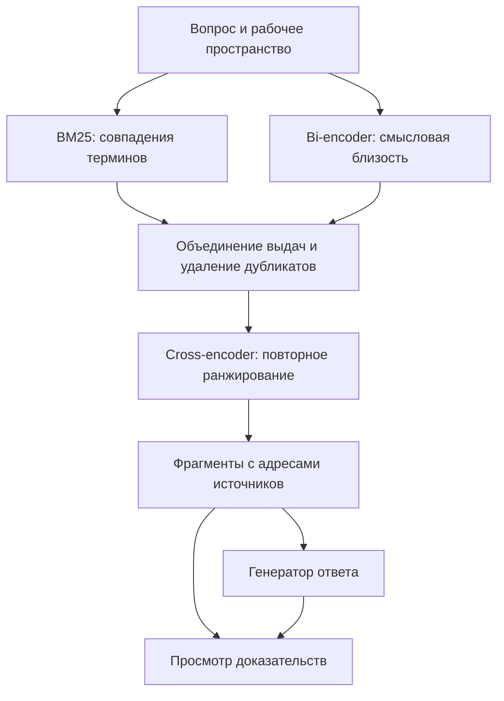

# Research Assistant

**Проект 181 · Поиск ответов в научной статье и её источниках**

Пользователь загружает статью, добавляет доступные работы из её библиографии и задаёт вопрос. Приложение ищет подходящие фрагменты в этом корпусе, составляет ответ и показывает, на какие страницы источников он опирается. По каждой ссылке можно вернуться к исходному тексту.

| Паспорт проекта | Сведения |
|---|---|
| Итоговая тема | **Research Assistant: поиск ответов в локальном графе научных публикаций** |
| Трек и уровень | Deep Learning · PRO |
| Тип проекта | Программный продукт с экспериментальной оценкой поиска |
| Команда | Татарченко Евгений Андреевич |
| Куратор | Соборнов Тимофей |
| Учебный период | 1 октября 2026 года — май 2027 года |
| Состояние на 02.10.2026 | Подготовлены постановка задачи, план и проект архитектуры. Приложение и экспериментальные результаты пока отсутствуют |

[План работы](docs/roadmap.md) · [Архитектура](docs/architecture.md) · [Протокол оценки](docs/research-protocol.md) · [Источники](docs/references.md)

## Зачем нужен проект

Чтобы проверить утверждение в научной статье, часто приходится открыть несколько цитируемых работ и найти в них нужное объяснение. Чат по одному PDF не видит эти источники. Ссылка в библиографии тоже не заменяет чтение: она может указывать на метод, набор данных, ограничение или спорный результат.

Проект объединяет основную статью и доступные цитируемые публикации в отдельное рабочее пространство. Связи между статьями помогают понять происхождение информации; поиск по полным текстам находит основания для ответа. Если нужного источника нет, система сообщает о пробеле.

## Как будет работать приложение

1. Пользователь загружает PDF или указывает arXiv-ссылку. Сервис извлекает текст и библиографию.
2. Для каждой библиографической записи сервис ищет метаданные и доступный полный текст. Недостающий PDF можно добавить вручную. Неоднозначное совпадение требует проверки.
3. Основная статья и найденные источники образуют корпус рабочего пространства. Фрагменты сохраняют связь с документом и страницей.
4. По вопросу выполняется поиск **BM25 + bi-encoder + cross-encoder**. Найденные доказательства передаются генератору ответа.
5. Рядом с ответом отображаются выдержки и ссылки на страницы PDF. Пользователь может открыть граф цитирования и проверить, откуда взят каждый фрагмент.

Первая версия рассчитана на англоязычные цифровые PDF в выбранной области NLP или CV. Основной эксперимент также проводится на английском. Вопросы на русском, сканы и поиск по изображениям страниц требуют отдельной проверки качества и не входят в ближайший этап.

## Основа поиска



| Компонент | Роль в системе | Что проверяем отдельно |
|---|---|---|
| **BM25** | Лексический поиск по словам и терминам; первый воспроизводимый baseline | Находит ли нужный фрагмент без нейронных моделей |
| **Bi-encoder** | Независимо кодирует вопрос и фрагменты; поиск по векторам дополняет лексическую выдачу | Находит ли смысловые переформулировки, которые пропустил BM25 |
| **Объединение выдач** | Соединяет два списка, сохраняет происхождение кандидатов и убирает точные дубликаты | Насколько расширился охват релевантных фрагментов |
| **Cross-encoder** | Совместно обрабатывает пары «вопрос — кандидат» и переставляет кандидатов по релевантности | Поднимает ли доказательство выше при приемлемой задержке |
| **Генератор** | Формулирует ответ по отобранным материалам | Подтверждены ли утверждения указанными фрагментами |

BM25 и bi-encoder ищут по одному корпусу **параллельно**. Cross-encoder работает с их общей выдачей, поэтому не может вернуть доказательство, которого нет среди кандидатов. Для первого опыта можно взять до 50 фрагментов из каждого поиска и передать генератору до 10 после ранжирования. Это стартовые настройки, которые предстоит измерить; число уникальных кандидатов зависит от пересечения выдач.

Модельная часть развивается постепенно: BM25, затем bi-encoder и гибридный поиск, затем cross-encoder. Для сравнения сохраняются одни и те же вопросы, эталонные ответы и версия корпуса. Прирост качества проверяется экспериментом и заранее не предполагается. Описание подхода retrieve-and-rerank приведено в [документации Sentence Transformers](https://www.sbert.net/examples/sentence_transformer/applications/retrieve_rerank/README.html).

## Что предстоит сделать

Ниже — проект обязательной версии приложения. Детали структуры кода можно менять по мере реализации; изменения объёма работы и порядка учебных этапов согласуются с куратором. Каждая часть должна иметь понятный способ проверки. Исследовательские расширения перечислены отдельно.

### 1. Приём статей и сбор источников

- [ ] Принимать основной PDF и arXiv-ссылку, сохранять идентификатор версии и контрольную сумму файла.
- [ ] Извлекать текст и весь список литературы. Для каждой записи хранить исходную строку и распознанные поля, даже если найти публикацию не удалось.
- [ ] Сначала искать точные DOI и arXiv ID, затем сверять название, авторов и год. Сомнительные совпадения не подтверждать автоматически.
- [ ] Загружать доступные полные тексты с ограничением частоты запросов, повторными попытками и журналом ошибок. Поддержать продолжение прерванного запуска.
- [ ] Различать отсутствие метаданных, неоднозначное совпадение, отсутствие открытого PDF, сетевую ошибку и повреждённый файл. Добавить ручную загрузку и исправление сопоставления.

**Проверка:** по основной статье можно проследить судьбу каждой записи библиографии. Повторный запуск не создаёт новые копии уже полученных файлов. Наличие метаданных не выдаётся за наличие полного текста.

### 2. Тексты, страницы и граф цитирования

- [ ] Разбить извлечённый текст на фрагменты с заголовком раздела, номером страницы и адресом в исходном документе.
- [ ] Хранить статьи и направленные связи «статья ссылается на источник». По возможности сохранять предложение с цитатой; отсутствие такой привязки отмечать явно.
- [ ] В первом корпусе ограничиться основной статьёй и её непосредственными источниками. Рекурсивное расширение вводить только с пределами глубины и числа документов.
- [ ] Учитывать дубликаты PDF и разные версии публикации. Один источник может относиться к нескольким рабочим пространствам.
- [ ] Версионировать корпус и настройки разбиения. Перестроение индекса не должно незаметно менять адрес доказательства в старом ответе.

**Проверка:** фрагмент из ответа открывает соответствующую страницу той же версии PDF. Граф отражает библиографические связи; само наличие ребра не считается доказательством утверждения.

### 3. Поиск и нейронное ранжирование

- [ ] Реализовать BM25 как самостоятельный метод и сохранить первую измеренную выдачу.
- [ ] Добавить предобученный bi-encoder, пакетное вычисление embeddings и векторный индекс. Версию модели и обработку запросов хранить в конфигурации.
- [ ] Объединять выдачи BM25 и bi-encoder через Reciprocal Rank Fusion; сохранять оценки и позиции обоих методов. Сначала удалять только точные дубликаты фрагментов.
- [ ] Применять cross-encoder к общему пулу. Лимит кандидатов и размер пакета выбирать по измеренным качеству, времени и памяти.
- [ ] Сравнить BM25, bi-encoder, гибрид и гибрид с cross-encoder на одинаковых данных. Дообучение рассматривать после оценки готовых моделей и достаточности разметки.

**Проверка:** для любого вопроса сохранены кандидаты до и после ранжирования. Можно отличить пропуск на этапе поиска от ошибки cross-encoder. Использование предобученных нейронных моделей не описывается как разработка собственной архитектуры.

### 4. Ответ по найденным материалам

- [ ] Отделить генератор от поиска единым интерфейсом. Первым вариантом может стать доступная бесплатная модель через OpenRouter.
- [ ] Передавать генератору только выбранные фрагменты с устойчивыми идентификаторами и ограничивать объём контекста.
- [ ] Возвращать ответ со ссылками на доказательства. Адреса PDF и страниц формировать из сохранённых данных, а не из придуманных моделью URL.
- [ ] Проверять существование ссылок и принадлежность фрагментов текущему пространству. Смысловую подтверждённость утверждений оценивать отдельно.
- [ ] При недостатке материала сообщать, что ответа в доступных источниках не найдено. При сбое внешней модели сохранять возможность читать найденные фрагменты.

**Проверка:** ответ не ссылается на отсутствующий PDF или неизвестный фрагмент. Сам факт корректного идентификатора не считается проверкой истинности текста.

### 5. API и фоновые задачи

- [ ] Начать с переиспользуемых Python-скриптов обработки данных; затем подключить их к FastAPI без переноса логики в обработчики HTTP.
- [ ] Вынести загрузку, разбор PDF и индексацию в фоновые задачи. Возвращать пользователю состояние обработки и причину неуспеха.
- [ ] Добавить ограниченные повторы, защиту от повторной обработки одного файла и возможность возобновить задачу.
- [ ] Хранить метаданные и связи в PostgreSQL, PDF — отдельно от базы. Для небольшой локальной выборки до сервиса достаточно файловых манифестов.
- [ ] Перед публичным запуском реализовать владение пространствами, проверку доступа к документам и удаление данных пользователя.

**Проверка:** перезапуск обработчика не теряет сведения о принятых документах; запрос к чужому пространству не возвращает его текст. Контейнерный запуск должен работать по опубликованной инструкции.

### 6. Веб-интерфейс

- [ ] Сделать создание рабочего пространства, загрузку основной статьи и добавление её источников.
- [ ] Показать библиографию со статусами полного текста и действиями для исправления ошибок.
- [ ] Добавить поле вопроса, ответ и карточки доказательств с просмотром PDF через PDF.js.
- [ ] Отобразить граф публикаций с переходом к документу и доступному контексту цитирования.
- [ ] Сохранять историю вопросов вместе с версией корпуса, чтобы объяснять изменение ответа после добавления источников.

**Проверка:** пользователь проходит полный сценарий от загрузки статьи до открытия доказательства без обращения к командной строке. Сначала обеспечивается переход на страницу; выделение точной области зависит от качества координат парсера.

### 7. Оценка качества и воспроизводимость

- [ ] Подготовить фиксированный набор вопросов, ответов и фрагментов из цитируемых работ. Правила разметки и формы данных вынесены из README в материалы второго чекпойнта.
- [ ] Считать качество retrieval отдельно от генерации: Recall@k и MRR@k по проверенным доказательствам, а также время ответа и расход памяти.
- [ ] Сохранять версии кода, корпуса, моделей и параметры каждого опыта. Данные и эксперименты учитывать через DVC и MLflow по мере появления реализованного конвейера.
- [ ] Проверять ошибки на отдельных примерах, в том числе при отсутствии источника и при неверно распознанной библиографии.
- [ ] Для научного сравнения позднее выделить независимые статьи и вопросы, которые не использовались при настройке.

**Проверка:** другой человек воспроизводит указанный запуск и получает сопоставимый отчёт. Небольшой набор, на котором выбирались параметры, не называется независимым итоговым тестом.

### 8. Эксплуатация и завершение продукта

- [ ] Зафиксировать совместимые зависимости, автоматизировать проверки через pytest, black и flake8.
- [ ] Подготовить запуск API, обработчика задач, базы и интерфейса через Docker Compose.
- [ ] Проверить одновременную обработку нескольких статей, ограничить очередь и измерить задержки на описанной машине.
- [ ] Сохранить резервную копию метаданных и инструкцию восстановления; исключить ключи доступа из Git.
- [ ] Подготовить демонстрационный сценарий, отчёт об известных ограничениях и инструкцию пользователя.

Общий проект модулей, данных и API приведён в [архитектуре](docs/architecture.md). На ранних этапах не требуются отдельная графовая база, кластер Kubernetes или локальная большая языковая модель.

### Дополнительные направления исследования

Эти варианты можно обсуждать после работающего поиска и первого отчёта о его ошибках. Для содержательной статьи достаточно одного хорошо проверенного вопроса; добавление всех вариантов в срок одного учебного года не планируется.

```text
Открытый набор данных по одной научной теме
Собрать более широкий корпус связанных публикаций и вопросы с проверенными
фрагментами ответов. Описать отбор статей, лицензии, ошибки разметки и разделение
данных. Сравнить четыре варианта поиска на независимой части корпуса.
Возможный вклад — воспроизводимый ресурс для межстатейного поиска.
Размер и отличия от существующих наборов нужно обосновать до расширения.
```

```text
Контекст цитирования для cross-encoder
Проверить, помогает ли предложение из основной статьи, содержащее ссылку,
лучше ранжировать фрагменты источника. Сравнить один и тот же пул кандидатов
с контекстом ссылки и без него; добавить контроль с перемешанными связями.
Дообучение вводить только при достаточных данных и доступных вычислениях.
Возможный вклад — измеренный эффект контекста и описание его границ.
```

```text
Доказательства в таблицах и рисунках: направление CV + NLP
На отдельной размеченной выборке сравнить текстовый поиск с поиском
по изображениям страниц. Проверить вопросы, ответ на которые теряется
при извлечении текста. Зафиксировать одинаковые документы и бюджет выдачи.
Возможный вклад — анализ того, когда визуальное представление полезно.
Обычный показ рисунка в интерфейсе сам по себе не является DL-исследованием.
```

```text
Неполный корпус и обоснованный отказ
Контролируемо удалять доступ к части источников, включая их текст, векторы
и кэш. Измерять, как меняются найденные доказательства, ошибочные ответы
и отказы. Различать недостаток данных и ошибку поиска по имеющимся данным.
Порог отказа выбирать на отдельной выборке, не по итоговому тесту.
```

## План на семь чекпойнтов

Первый дедлайн — **6 октября 2026 года**. Второй ориентировочно приходится на **конец октября**; точная дата ещё не объявлена. Сроки и распределение последующих работ ниже — рабочий план до мая, который уточняется по календарю курса. Промежуточная защита учитывается отдельно после объявления её формата.

| № | Срок или рабочий интервал | Основной результат |
|---|---|---|
| **1** | **1–6 октября 2026** | Репозиторий, README с темой, командой, куратором и планом; организационное обсуждение |
| **2** | Октябрь; ориентир — конец месяца | Сбор цитируемых статей и анализ данных; фиксированные вопросы, ответы и доказательства для минимум пяти основных статей |
| **3** | Ноябрь 2026, предварительно | Воспроизводимый BM25 baseline и разбор ошибок на подготовленных данных |
| **4** | Декабрь 2026, предварительно | Первый сервис: загрузка, обработка, поиск, просмотр доказательств и простой веб-интерфейс |
| **5** | Январь–февраль 2027, предварительно | Bi-encoder и гибридный поиск; сравнение с BM25 на прежнем наборе |
| **6** | Март–апрель 2027, предварительно | Cross-encoder, сравнение всех вариантов; подключение и оценка ответа по найденным фрагментам |
| **7** | Май 2027, предварительно | Проверенный веб-продукт, воспроизводимый отчёт, демонстрация и итоговая защита |

[Материалы первого чекпойнта](docs/checkpoints/checkpoint-01.md) · [Подготовка ко второму чекпойнту](docs/checkpoints/checkpoint-02.md) · [Подробный план и условия готовности](docs/roadmap.md)

## Вычисления и научный результат

Первый чекпойнт и сбор данных не зависят от GPU или оплаченного LLM API. BM25 запускается на CPU; небольшие нейронные модели сначала проверяются на доступной машине с измерением времени и памяти. Бесплатный вариант OpenRouter подходит для пилотной генерации вопросов и ответов, но его доступность и лимиты проверяются перед запуском. Конкретная модель, провайдер и параметры сохраняются; при их смене результаты не смешиваются в одном сравнении. Условия сервиса приведены в [официальной документации](https://openrouter.ai/docs/api/reference/limits).

Обязательный итог — работающее приложение и честное сравнение методов поиска. Возможная публикация развивается параллельно: сначала формулируется проверяемый вопрос, затем собираются данные и результаты. Ни наличие графа, ни использование готовых нейронных моделей сами по себе не доказывают научную новизну. Уровень публикационной площадки выбирается по полученному результату; принятие статьи заранее не обещается.

Автор проекта отвечает за понимание кода, выбор данных и обоснование выводов. Подготовленный инструмент должен воспроизводиться и объясняться на защите: от одной записи библиографии до найденного доказательства и рассчитанной метрики.
