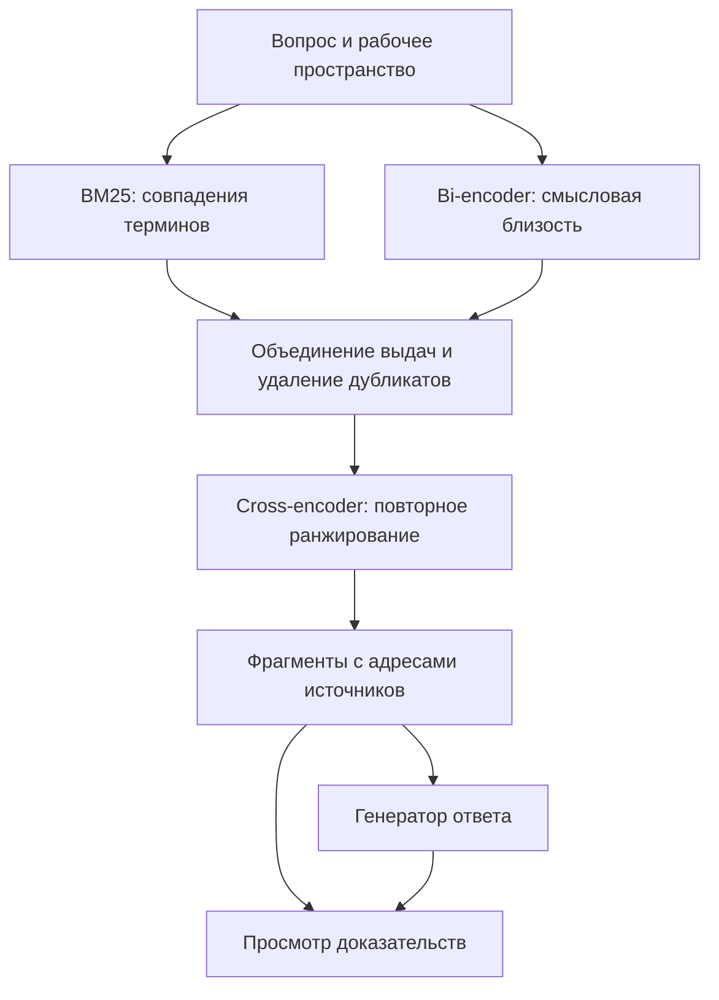
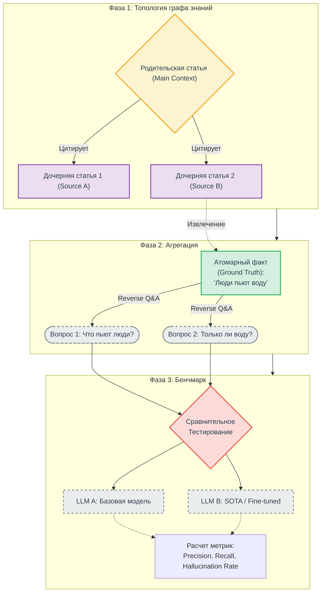

# Research Assistant

Пользователь загружает статью, добавляет доступные работы из её библиографии и задаёт вопрос. Приложение ищет подходящие фрагменты в этом корпусе, составляет ответ и показывает, на какие страницы источников он опирается. По каждой ссылке можно вернуться к исходному тексту.

| Паспорт проекта | Сведения |
|---|---|
| Итоговая тема | **Research Assistant: поиск ответов в локальном графе научных публикаций** |
| Трек и уровень | Deep Learning · PRO |
| Тип проекта | Программный продукт с экспериментальной оценкой поиска |
| Команда | Татарченко Евгений Андреевич |
| Куратор | Соборнов Тимофей |
| Учебный период | 1 октября 2026 года — май 2027 года |
| Состояние на 02.10.2026 | Подготовлены постановка задачи, план и проект архитектуры. Приложение и экспериментальные результаты пока отсутствуют |

[План работы](docs/roadmap.md) · [Архитектура](docs/architecture.md) · [Протокол оценки](docs/research-protocol.md) · [Источники](docs/references.md)

## Зачем нужен проект

Чтобы проверить утверждение в научной статье, часто приходится открыть несколько цитируемых работ и найти в них нужное объяснение. Чат по одному PDF не видит эти источники. Ссылка в библиографии тоже не заменяет чтение: она может указывать на метод, набор данных, ограничение или спорный результат.

Проект объединяет основную статью и доступные цитируемые публикации в отдельное рабочее пространство. Связи между статьями помогают понять происхождение информации; поиск по полным текстам находит основания для ответа. Если нужного источника нет, система сообщает о пробеле.

## Как будет работать приложение

1. Пользователь загружает PDF или указывает arXiv-ссылку. Сервис извлекает текст и библиографию.
2. Для каждой библиографической записи сервис ищет метаданные и доступный полный текст. Недостающий PDF можно добавить вручную. Неоднозначное совпадение требует проверки.
3. Основная статья и найденные источники образуют корпус рабочего пространства. Фрагменты сохраняют связь с документом и страницей.
4. По вопросу выполняется поиск **BM25 + bi-encoder + cross-encoder**. Найденные доказательства передаются генератору ответа.
5. Рядом с ответом отображаются выдержки и ссылки на страницы PDF. Пользователь может открыть граф цитирования и проверить, откуда взят каждый фрагмент.

Первая версия рассчитана на англоязычные цифровые PDF в выбранной области NLP или CV. Основной эксперимент также проводится на английском. Вопросы на русском, сканы и поиск по изображениям страниц требуют отдельной проверки качества и не входят в ближайший этап.

## Основа поиска

| Компонент | Роль в системе | Что проверяем отдельно |
|---|---|---|
| **BM25** | Лексический поиск по словам и терминам; первый воспроизводимый baseline | Находит ли нужный фрагмент без нейронных моделей |
| **Bi-encoder** | Независимо кодирует вопрос и фрагменты; поиск по векторам дополняет лексическую выдачу | Находит ли смысловые переформулировки, которые пропустил BM25 |
| **Объединение выдач** | Соединяет два списка, сохраняет происхождение кандидатов и убирает точные дубликаты | Насколько расширился охват релевантных фрагментов |
| **Cross-encoder** | Совместно обрабатывает пары «вопрос — кандидат» и переставляет кандидатов по релевантности | Поднимает ли доказательство выше при приемлемой задержке |
| **Генератор** | Формулирует ответ по отобранным материалам | Подтверждены ли утверждения указанными фрагментами |

BM25 и bi-encoder ищут по одному корпусу **параллельно**. Cross-encoder работает с их общей выдачей, поэтому не может вернуть доказательство, которого нет среди кандидатов. Для первого опыта можно взять до 50 фрагментов из каждого поиска и передать генератору до 10 после ранжирования. Это стартовые настройки, которые предстоит измерить; число уникальных кандидатов зависит от пересечения выдач.

Модельная часть развивается постепенно: BM25, затем bi-encoder и гибридный поиск, затем cross-encoder. Для сравнения сохраняются одни и те же вопросы, эталонные ответы и версия корпуса. Прирост качества проверяется экспериментом и заранее не предполагается. Описание подхода retrieve-and-rerank приведено в [документации Sentence Transformers](https://www.sbert.net/examples/sentence_transformer/applications/retrieve_rerank/README.html).

## Методология оценки качества RAG-системы (Golden Dataset Benchmark)

В данном разделе задокументирована архитектура пайплайна для объективного, воспроизводимого и детерминированного тестирования больших языковых моделей в рамках проекта Research Assistant. Метод основан на графовом анализе академического цитирования и позволяет измерять способность системы извлекать изолированные факты из внешних источников и релевантно интегрировать их в исходный контекст.

### Архитектура контура тестирования

Ниже представлена граф-схема, иллюстрирующая полный жизненный цикл формирования эталонного датасета (Golden Dataset) и процесс бенчмаркинга. 

### 1. Топологическая модель данных
Структура анализируемого корпуса документов строго формализована в виде направленного графа, что отражает реальную логику юридического или научного исследования:
*   **Родительские узлы (Parent Articles):** Базовые документы или исходные пользовательские запросы. Они формируют семантическое ядро и определяют глобальный контекст задачи.
*   **Дочерние узлы (Child Articles / Citations):** Периферийные документы, нормативные акты или статьи, на которые ссылается родительский узел. Выступают в роли изолированных хранилищ дополнительных, узкоспециализированных фактов.

### 2. Механизм обратной генерации (Reverse Q&A Generation)
Для создания объективной базы тестирования применяется метод синтеза запросов от готового ответа. Это исключает предвзятость при составлении вопросов и гарантирует наличие точного ответа в базе:
1.  **Локализация Ground Truth:** Из дочерней статьи автоматизированно или вручную извлекается неопровержимый атомарный факт (например, конкретная норма права или научный постулат).
2.  **Синтез вектора вопросов:** На основе изолированного факта генерируется набор вопросов, варьирующихся по синтаксической структуре и уровню абстракции. Это позволяет проверить устойчивость LLM к различным формулировкам промпта.
3.  **Формирование триплетов:** Создается структура данных, связывающая исходный контекст, вопрос и эталонный ответ.

### Структура эталонного элемента данных (Golden Record):

| Идентификатор | Родительский контекст | Источник факта (Дочерний) | Синтезированный вопрос | Эталонный ответ (Ground Truth) |
| :--- | :--- | :--- | :--- | :--- |
| `eval_001` | Текст статьи А (Контекст) | Текст статьи B (Цитата) | *Что является основным источником гидратации?* | Люди пьют воду. |
| `eval_002` | Текст статьи А (Контекст) | Текст статьи B (Цитата) | *Существуют ли альтернативы воде для гидратации?* | Выборка не содержит данных об альтернативах. |

### Пример структуры для более прикладного применения:

| ID | Родительский контекст | Источник (Дочерний узел) | Синтезированный вопрос | Эталонный ответ (Ground Truth) |
|---|---|---|---|---|
| `eval_001` | Анализ наследственных споров | Постановление Пленума ВС РФ от 29.05.2012 № 9 | Допускается ли отзыв отказа от наследства? | Нет. Отказ от наследства является односторонней сделкой и не может быть взят обратно после его совершения (п. 3 ст. 1157 ГК РФ). |
| `eval_002` | Анализ наследственных споров | Постановление Пленума ВС РФ от 29.05.2012 № 9 | Можно ли оспорить отказ от наследства? | Да, по общим основаниям недействительности сделок (ст. 179 ГК РФ - обман, насилие, угроза). |
| `eval_003` | Анализ наследственных споров | Постановление Пленума ВС РФ от 29.05.2012 № 9 | Может ли наследник принять наследство частично? | Нет. Принятие части наследства означает принятие всего причитающегося (универсальное правопреемство, ст. 1110, 1152 ГК РФ). |

### 3. Детерминированный бенчмаркинг и оценка (Evaluation)
Сгенерированная выборка фиксируется («замораживается»), образуя статичный тестовый полигон. Данный подход обеспечивает академическую строгость при тестировании Research Assistant и решает следующие инженерные задачи:
*   **LLM-агностичность:** Позволяет проводить полностью идентичные прогоны (runs) для локальных моделей и коммерческих API, исключая влияние изменения данных на результат.
*   **Защита от регрессий:** При внесении изменений в пайплайн векторизации, системные промпты или алгоритмы чанкинга, прогон по Golden Dataset мгновенно подсвечивает деградацию качества (Knowledge Retrieval Degradation).
*   **Анализ галлюцинаций:** Поскольку модель обязана оперировать только предоставленными дочерними текстами, любые отклонения от Ground Truth классифицируются и количественно измеряются как галлюцинации.

## Примерный план

| № | Срок или рабочий интервал | Основной результат |
|---|---|---|
| **1** | **1–6 октября 2026** | Репозиторий, README с темой, командой, куратором и планом; организационное обсуждение |
| **2** | Октябрь; ориентир — конец месяца | Сбор цитируемых статей и анализ данных; фиксированные вопросы, ответы и доказательства для минимум пяти основных статей |
| **3** | Ноябрь 2026, предварительно | Воспроизводимый BM25 baseline и разбор ошибок на подготовленных данных |
| **4** | Декабрь 2026, предварительно | Первый сервис: загрузка, обработка, поиск, просмотр доказательств и простой веб-интерфейс |
| **5** | Январь–февраль 2027, предварительно | Bi-encoder и гибридный поиск; сравнение с BM25 на прежнем наборе |
| **6** | Март–апрель 2027, предварительно | Cross-encoder, сравнение всех вариантов; подключение и оценка ответа по найденным фрагментам |
| **7** | Май 2027, предварительно | Проверенный веб-продукт, воспроизводимый отчёт, демонстрация и итоговая защита |

[Материалы первого чекпойнта](docs/checkpoints/checkpoint-01.md) · [Подготовка ко второму чекпойнту](docs/checkpoints/checkpoint-02.md) · [Подробный план и условия готовности](docs/roadmap.md)

