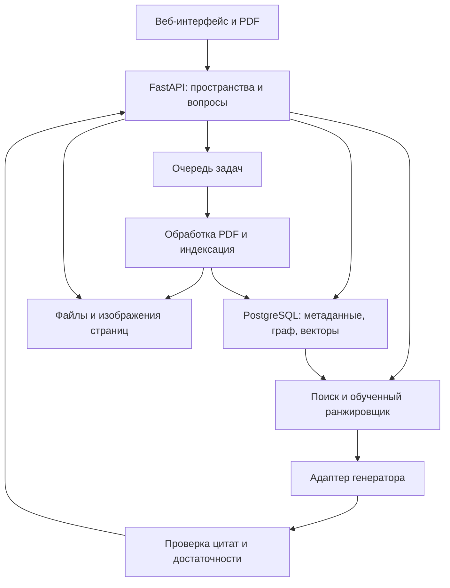

# Архитектура будущего приложения

[Вернуться к проекту](../README.md)

Документ описывает целевое устройство сервиса. Компоненты пока не реализованы. Конкретные версии зависимостей фиксируются после проверки совместимости на первом чекпойнте.

## 1. Границы первой версии

Веб-приложение принимает цифровые PDF и arXiv-ссылки, извлекает библиографию и позволяет вручную добавить цитируемые статьи. Для каждого исходного документа создаётся отдельное пространство. Автоматическое получение источников ограничено разрешёнными открытыми адресами и установленным числом документов.

По умолчанию обрабатываются непосредственно цитируемые работы. Второй переход разрешается по запросу и в пределах общей квоты. Предварительные пределы: 50 МБ и 100 страниц на PDF, до 40 полных текстов в пространстве. Они проверяются в пилоте; научный эксперимент использует собственный фиксированный манифест. Недоступные статьи сохраняются как узлы с метаданными. Пользователь может добавить соответствующий PDF позже.

Из первой версии исключены общий веб-поиск без ограничений, обход платного доступа, автоматическое написание литературного обзора для публикации, совместное редактирование, собственное обучение большой генеративной модели и обещание поддержки любого скана. Исследовательский вывод ограничен проверенным корпусом NLP/CV.

## 2. Компоненты

| Компонент | Предлагаемое решение и причина |
|---|---|
| Интерфейс | React + TypeScript; загрузка, статусы источников, граф и PDF.js. Node-зависимости закрепляются отдельно |
| HTTP API | FastAPI; валидация входа, аутентификация, доступ к пространствам и потоковая выдача ответа |
| Фоновая обработка | Celery + Redis; задания разбора, разрешения ссылок, embeddings и удаления. API не держит соединение до конца индексации |
| Разбор PDF | GROBID как отдельный сервис для структуры и библиографии; извлечение координат и изображений страниц; OCR для явно поддержанного поднабора |
| Хранение | PostgreSQL для метаданных, связей и состояния; pgvector для векторов; файлы отдельно в S3-совместимом хранилище или локальном каталоге разработки |
| Лексический поиск | Отдельный BM25-индекс пространства, построенный из тех же фрагментов. Полнотекстовый поиск PostgreSQL не называется BM25 без реализации этого алгоритма |
| Граф | Таблицы узлов и рёбер в PostgreSQL. Для глубины до двух переходов отдельная графовая СУБД пока не нужна |
| ML | PyTorch, закреплённые embeddings, текстовый и графовый ранжировщики; готовый визуальный retriever для CV-эксперимента |
| Наблюдаемость | MLflow для экспериментов; структурированные логи, метрики очереди, ошибок, p95 и внешних квот для сервиса |
| Развёртывание | Docker Compose для воспроизведения и первого сервера; горизонтальное увеличение числа workers после измерения нагрузки |

Выбор этих компонентов не означает, что их совместимость с Python 3.10.4 проверена. Парсер и визуальный inference могут работать в отдельных закреплённых контейнерах. Изменение обязательного Python-окружения оформляется решением, описанным ниже.

## 3. Данные, версии и источник ответа

Основные сущности: `Workspace`, `DocumentVersion`, `Reference`, `CitationEdge`, `EvidenceBlock`, `IndexVersion`, `Job`, `Answer`.

У `DocumentVersion` сохраняются DOI/arXiv ID, версия, хеш файла, URL происхождения и лицензия. DOI не заменяет хеш PDF: у препринта и журнальной версии могут различаться страницы. У `EvidenceBlock` есть номер страницы с отсчётом от 1, тип блока, координаты, текстовый интервал и версия парсера. Номер страницы PDF отличают от напечатанного номера журнала.

Ребро графа хранит исходный документ, библиографическую запись, канонический источник, контекст цитирования и уверенность сопоставления. Неоднозначная запись требует подтверждения. Ссылки на источник без полного текста не превращаются в содержательные доказательства.

Индекс перестраивается как новая версия. После успешного завершения пространство атомарно переключается на неё. Ответ сохраняет точную версию индекса, найденные evidence IDs и параметры генератора. После изменения корпуса старый ответ помечается как относящийся к прежнему состоянию, а не получает новые источники молча.

Каждый запрос к базе, векторному и BM25-индексу фильтруется по владельцу и пространству. Кэш включает идентификатор пространства, версии корпуса, модели и промпта. Перед выдачей цитаты сервер проверяет существование блока и право доступа к нему. При удалении пространства удаляются файлы, векторы, граф, ответы и кэш; правила удаления из резервных копий документируются отдельно.

## 4. Обработка ошибок и ограничения ввода

Состояния задания: `queued`, `running`, `partial`, `completed`, `failed`, `cancelled`. Пользователь видит прогресс и причину неполного результата. Повторная загрузка того же файла с теми же настройками не создаёт новую задачу индексации без необходимости.

PDF обрабатывается с ограничениями размера, страниц, памяти и времени, без исполнения вложенного кода. Загрузчик внешних файлов принимает только разрешённые схемы и домены; проверяет адрес после перенаправления и не обращается к внутренним адресам сервера. Предварительный список источников и правила расширения фиксируются до публичного доступа.

Текст PDF считается недоверенным содержимым. Инструкции внутри статьи не могут менять системные правила, запускать команды или отправлять другие документы. Генератор получает только выбранные фрагменты текущего пространства. Вывод модели проходит проверку схемы и evidence IDs; ошибочная цитата не превращается в рабочую ссылку.

Повторные попытки внешних вызовов ограничены; учитываются `Retry-After`, экспоненциальная задержка и суточная квота. После устойчивой ошибки вызовы временно прекращаются, задача получает понятный статус. Повторный запуск продолжает работу с последнего сохранённого этапа. Отдельные сбои парсера, индекса и генератора проверяются в интеграционных тестах.

Неопубликованные пользовательские материалы не отправляются во внешний API без явного выбора такого режима и информации о провайдере. Демо использует открытые статьи. Ключи хранятся только на сервере, не попадают в JavaScript, логи и репозиторий. В логах по умолчанию сохраняются технические идентификаторы и метрики, а не содержимое частных документов.

## 5. OpenRouter и модель с открытыми весами

### Решение для прототипа

Бесплатный вариант OpenRouter допустим как генератор ранней версии. Он получает от системы найденные доказательства, возвращает структурированный ответ, а приложение проверяет ссылки. Библиография, graph retrieval, embeddings и обучаемый ранжировщик работают независимо от него.

По официальной справке, проверенной 02.10.2026, начальный бесплатный доступ ограничен 50 запросами в сутки и 20 в минуту; приобретение не менее 10 долларов кредитов связано с повышенным суточным лимитом 1000. Это условия сервиса на дату проверки, не обещание доступности до мая. Перед работой проверяются фактические квоты ключа и конкретной модели. Источники: [лимиты](https://openrouter.ai/docs/api_reference/limits), [пояснение OpenRouter](https://openrouter.zendesk.com/hc/en-us/articles/39501163636379-OpenRouter-Rate-Limits-What-You-Need-to-Know).

Для оценки масштаба: 180 вопросов × 6 условий × 3 повторения = 3240 генераций. Даже при одном вызове на ответ и полном использовании квоты 50 в сутки требуется минимум 65 суток. Это расчёт сценария, а не фактический план расхода; абляции, проверки ответов и повторы после ошибок увеличивают число вызовов. Бесплатный endpoint не подходит как единственный ресурс для апрельской экспериментальной серии.

### Решение для исследования

Предпочтение отдаётся локальному генератору с открытыми весами и закреплённой ревизией при наличии подходящей GPU. После пилота сравниваются два доступных кандидата по качеству цитирования, памяти, задержке и лицензии. Объём 3–8 млрд параметров рассматривается как начальный диапазон, а не требование, которое уже проверено на оборудовании.

Если локальный inference недоступен, нужен согласованный лимит API и фиксированный идентификатор модели; использование платного ресурса требует отдельного решения владельца. Случайный выбор из бесплатных моделей и автоматическое переключение на другую модель внутри экспериментальной серии запрещены. При смене провайдера результаты размечаются как отдельное условие либо серия повторяется.

В продукте предусмотрены кэш, ограничение длины ответа и режим выдачи найденных фрагментов без генерации. Автоматические платные fallback-вызовы отключены. Использование бесплатной модели не означает бесплатные вычисления embeddings, обучение и хранение.

Условия обработки входов OpenRouter и фактического inference-провайдера проверяются раздельно; их политика хранения может отличаться. [Документация о данных](https://openrouter.ai/docs/guides/privacy/data-collection) служит исходной точкой этой проверки.

## 6. Соответствие требованиям магистратуры

Таблица сохраняет исходные требования и отделяет предложенные решения от согласованных. На 02.10.2026 согласование отклонений не зафиксировано.

| Требование | План использования | Статус решения |
|---|---|---|
| Python 3.10.4 | Воспроизводимое учебное окружение с закреплёнными совместимыми версиями; для публичного сервера предложен поддерживаемый Python 3.12 или 3.13 после проверки зависимостей | Изменение серверной версии требует согласования на CP1 |
| pip, conda | pip для установки закреплённого экспорта; conda как отдельный документированный вариант GPU-окружения, если требуется программой | Обязательность обоих инструментов уточнить на CP1 |
| pyenv, poetry | pyenv задаёт интерпретатор; poetry хранит декларацию зависимостей и lock-файл; совместимые версии инструментов фиксируются | Принято в план, совместимость ещё не проверена |
| pyenv-virtualenv | Создаёт основное учебное окружение; poetry использует его без второго вложенного venv. Среда самого инструмента может быть отдельной | Принято в план |
| git (gitlab) | Git и GitHub по явно указанному адресу задания; при обязательности GitLab добавить зеркало после согласования | GitHub задан владельцем проекта |
| DVC, Google Drive | Версии корпуса, индексов и разрешённых моделей; `dvc.yaml` для стадий; Google Drive remote без секретов в Git | Нужен предоставленный доступ к remote на CP2 |
| Cookiecutter | Структура Python-проекта из закреплённого шаблона; записать URL шаблона и его ревизию | CP2 |
| flake8, black | Проверки стиля Python в CI; единая настройка длины строки | CP2 и далее |
| click, argparse | CLI на Click для ingest/train/evaluate; argparse остаётся доступен для простых сценариев, если оба инструмента обязательны | Уточнить трактовку перечня на CP1 |
| MLflow | Метрики, параметры, артефакты и связь с версиями данных. Эксплуатационный мониторинг добавляется отдельно | CP2 и далее |
| CatBoost, sklearn, pandas, NumPy, PyTorch | PyTorch для DL; pandas/NumPy для данных; sklearn для разбиений и метрик; CatBoost как дешёвый контроль ранжирования по тем же числовым/замороженным признакам | ML-компонент вспомогательный, DL остаётся обязательным |
| pyautogui для parsing | По назначению это автоматизация GUI. Для серверного разбора PDF предложен GROBID и координатный экстрактор; pyautogui возможен только для отдельного GUI smoke-теста при требовании курса | Замену parsing-стека согласовать на CP1 |
| pytest | Тесты парсинга, сопоставления ссылок, графа, доступа, поиска, метрик, отказов и API | С появлением соответствующего кода |
| Полноценный сервис; highload/оркестрация | API, фоновые workers, очередь, кеш, контейнерная оркестрация, идемпотентность и измеренная нагрузка | Целевой результат CP6–CP7 |

Официальный [PEP 619](https://peps.python.org/pep-0619/) сообщает о завершении поддержки Python 3.10 с 01.10.2026. Версия 3.10.4 выпущена в 2022 году. Поэтому она не выбирается молча для публичного сервера на май 2027 года. До решения куратора точное учебное окружение допускается только изолированно; публикация сервиса зависит от согласования поддерживаемого runtime. Нельзя обещать совместимость актуального DL-стека с 3.10.4 без теста.

Исходный список сочетает альтернативные менеджеры окружений. На CP1 нужно уточнить, требуется ли буквальное использование каждого. Основной lock-файл должен иметь один источник; conda-экспорт не редактируется независимо от него без проверки расхождений. Здесь не принято решение исключить обязательный инструмент без согласования.

## 7. Ресурсы и эксплуатационные цели

Плановый стенд: Linux, 8 vCPU, 32 ГБ RAM, SSD; для обучения небольшого ранжировщика и визуальных опытов предполагается GPU с 16–24 ГБ VRAM. Для локального генератора бюджет памяти зависит от checkpoint, квантования, контекста и batch size. Значения проверяются пилотом, доступ к оборудованию пока не подтверждён.

Сначала проводится измерение на 10 PDF и 30 вопросах. По нему оцениваются хранение, время всего корпуса и стоимость серии. На CP1 согласуются потолок GPU-часов и бюджет API; в этой версии плана покупка ресурсов не разрешается и цена будущего inference не выдумывается.

| Проверка | Предварительная цель и условия |
|---|---|
| Собственный retrieval | p95 ≤ 3 с при 10 одновременных поисковых запросах по прогретому индексу пространства, без генерации; стенд и размер корпуса записаны |
| Базовая индексация | p95 ≤ 120 с на цифровой PDF до 30 страниц без OCR, внешнего скачивания и визуальных embeddings; отдельное измерение для CV-конвейера |
| Ошибки собственного API | < 1% за 30-минутный прогон заданного профиля; намеренные 4xx и ошибки внешнего провайдера показываются отдельно |
| Фоновые задачи | 20 заданий на индексацию в очереди; остановка worker не теряет принятое задание и не создаёт дубликат результата |
| Ответ генератора | Измеряются p50/p95 до первого токена и до завершения, таймауты, токены и цена. Единый SLA бесплатного API не обещается |
| Изоляция | Тесты исключают доступ к PDF, векторам, графу и ответам другого пространства; проверяется обход прямой ссылкой |
| Восстановление | Резервная копия базы и файлов реально развёрнута на чистом стенде; измерены время и полнота восстановления |

Эти цели проверяются, а не изображают достигнутую высокую нагрузку. Если ресурсный стенд другой, профиль фиксируется до прогона. Синтетическая нагрузка с заглушкой генератора оценивает только собственную инфраструктуру; реальная проверка API проводится отдельно в допустимых квотах. Kubernetes не включён в обязательный минимум без подтверждённой необходимости.

## 8. Приёмочные сценарии

1. **Статья и источники.** Пользователь загружает основной PDF и два цитируемых документа, видит их в одном пространстве, задаёт межстатейный вопрос и открывает каждый доказательный фрагмент на нужной странице.
2. **Недоступный источник.** Один необходимый PDF отсутствует. Система сообщает о пробеле, не пересказывает выдуманное содержание; после загрузки документа пересчитывает индекс и позволяет повторить вопрос.
3. **Изоляция и удаление.** Два пространства содержат разные статьи. Поиск и прямые URL не раскрывают соседнее пространство. После удаления его данные недоступны через API и кэш.
4. **Сбой и повтор.** Worker остановлен во время обработки или внешний API вернул 429. Пользователь видит состояние, повтор не дублирует записи, сохранённый этап позволяет продолжить задачу.
5. **Таблица или рисунок.** Вопрос требует визуального доказательства. Система находит правильную страницу и открывает область; ответ по самому изображению выдаётся только моделью, которая действительно получила изображение.

Первые четыре сценария обязательны для базовой версии CP3; пятый проходит в CP5. На CP3 проверяется его заготовка: наличие разметки и корректное отображение страницы, без заявления о готовом визуальном поиске. Все пять обязательны для итоговой версии в согласованном объёме.

## 9. Риски и заранее выбранные действия

| Риск | Как обнаружить | Действие |
|---|---|---|
| Недостаточная новизна | Ближайший метод решает ту же задачу тем же обучением | Изменить исследовательский вопрос до test; сохранить честное сравнение |
| Бесплатная модель недоступна | Ошибки, изменение каталога, квоты | Выдать фрагменты без генерации; для исследований использовать согласованный закреплённый ресурс |
| Малый или связный корпус | Не хватает независимых тестовых групп, широкие интервалы | Добрать исходные статьи; сузить силу вывода; не считать связанные фрагменты независимыми |
| Нет второй проверки | Не согласован оценщик или расход времени больше плана | Зафиксировать ограничение и не называть оценку независимой |
| Ошибки PDF и библиографии | Аудит ссылок и координат не проходит пороги | Ограничить поддерживаемые форматы, включить ручное подтверждение |
| Превышение бюджета | Пилот показывает неприемлемые GPU-часы или API-вызовы | Уменьшить дополнительные прогоны до открытия test; сохранить основное сравнение и DL-обучение |
| Нестабильное окружение | Зависимости не устанавливаются на заданный Python | Закрепить совместимую сборку; согласовать поддерживаемое серверное окружение |
| Завышенные выводы | Выигрыш зависит от одного seed, направления или промпта | Показать разброс, подгруппы и отрицательные результаты; ограничить формулировку статьи |

Порядок внедрения и точки пересмотра этих решений указаны в [дорожной карте](roadmap.md).
